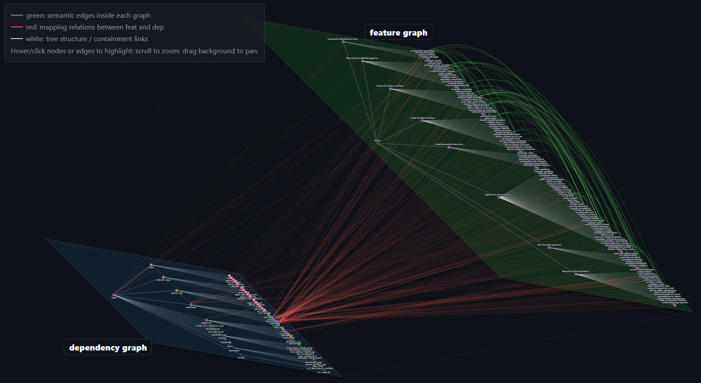

<h1 align="center">RPG-Kit</h1>

<p align="center">
  <a href="README.md">English</a> |
  <a href="README.zh-CN.md">简体中文</a> |
  <a href="README.ja-JP.md">日本語</a> |
  <a href="README.ko-KR.md">한국어</a> |
  <a href="README.hi-IN.md">हिन्दी</a>
</p>

## Make AI coding agents understand the whole repository

AI coding agents are powerful, but they often work file by file. As a project grows, they can lose track of requirements, architecture, dependencies, and previous design decisions.

RPG-Kit helps solve this by maintaining a **Repository Planning Graph (RPG)**: a structured map that connects requirements, features, files, components, and dependencies.

Use RPG-Kit when you want AI agents to work with repository-level context instead of isolated prompts!

### Choose your workflow

| Goal | Workflow | Start here |
|---|---|---|
| Create a new project from requirements | Forward workflow | [`Quick Start: New Repository`](#quick-start-new-repository) |
| Understand or update an existing codebase | Reverse workflow | [`Quick Start: Existing Repository`](#quick-start-existing-repository) |
| Make a precise repository-aware edit | Surgical edit workflow | [`Quick Start: New Repository`](#quick-start-new-repository) |

Below is part of the graph visualization generated for this repository. Run `/rpgkit.encode` and open `rpg.html` to explore the full interactive graph.



### Workflow Details

```text
Forward Direction: Requirements → RPG → Code

 Phase 1: Feature Specification       Phase 2: RPG Construction & Planning                             Phase 3
┌──────────┐ ┌──────────┐ ┌──────────┐ ┌──────────┐ ┌──────────┐ ┌──────────┐ ┌──────────┐ ┌──────────┐ ┌──────────┐
│ feature  │ │ feature  │ │ feature  │ │  build   │ │  build   │ │ design   │ │ design   │ │  plan    │ │          │
│  _spec   ├─▶  _build  ├─▶_refactor ├─▶ skeleton ├─▶  data    ├─▶  base    ├─▶interfaces├─▶  tasks  ├─▶ code_gen │
│          │ │          │ │          │ │          │ │  flow    │ │ classes  │ │          │ │          │ │   (TDD)  │
└──────────┘ └──────────┘ └────┬─────┘ └──────────┘ └──────────┘ └──────────┘ └──────────┘ └──────────┘ └────┬─────┘
 feature_     feature_        │        skeleton     data_flow    base_        interfaces   tasks        source
 spec/        build           │        .json        .json        classes      .json        .json        code
 feature_     .json           │        skeleton_    data_flow    .json
 spec.json                    │        summary.txt  _viz.html
                              │
                       ┌──────▼──────┐
                       │ feature_edit│ optional pre-planning edits to feature_tree.json
                       └─────────────┘
                                        ╰───── rpg.json (created → progressively enriched) ─────╯
                                                                            │
                                                                            ▼
                                                                     ┌──────────┐
Surgical edit workflow: Requirements -> RPG update -> Code Update    │ rpg_edit │ optional synchronized RPG + code + dep_graph edits
                                                                     └──────────┘

Reverse Direction: Code → RPG

┌──────────────────┐         ┌──────────┐       ┌──────────┐
│ Existing Codebase│────────▶│  encode  │──────▶│update_rpg│
│                  │         │  (full)  │       │ (manual  │
└──────────────────┘         └──────────┘       │ fallback)│
                              rpg.json          └──────────┘
                              dep_graph.json     rpg.json / dep_graph.json
                                                  ▲
                                                  │ post-commit hook normally runs incremental updates

MCP Server: search_rpg / explore_rpg / get_node_detail / list_rpg_tree
```

## Installation

### Prerequisites

- Python 3.12+
- [uv](https://docs.astral.sh/uv/)
- Git
- An installed and authenticated AI coding agent CLI: [GitHub Copilot](https://docs.github.com/en/copilot) or [Claude Code](https://docs.anthropic.com/en/docs/claude-code/setup)

### Install RPG-Kit

```bash
# For persistent installation (Recommended)
uv tool install rpgkit-cli --from "git+https://github.com/microsoft/RPG-ZeroRepo.git#subdirectory=RPG-Kit"
rpgkit check

# For one-time usage
uvx --from "git+https://github.com/microsoft/RPG-ZeroRepo.git#subdirectory=RPG-Kit" rpgkit init <project-name>
```

## Quick Start: New Repository

Use this path when you want RPG-Kit to turn requirements into a new codebase.

> [!WARNING]
> For projects with a large amount of generated code, `/rpgkit.design_interfaces` and `/rpgkit.code_gen` can take a long time to run. As a typical example: 100 features take about 30 minutes.

1. Initialize a new project:

   ```bash
   rpgkit init my-project
   cd my-project
   ```

   Common variants:

   ```bash
   rpgkit init my-project --ai claude --script sh
   rpgkit init my-project --ai copilot
   rpgkit init my-project --github-token $GITHUB_TOKEN
   ```

2. **[Optional]** place your requirement documents in `my-project/docs/`.

3. Launch your AI coding agent in the project directory.

4. Run the forward pipeline:

   ```text
   /rpgkit.feature_spec <feature description>
   /rpgkit.feature_build
   /rpgkit.feature_refactor
   [Optional] /rpgkit.feature_edit <edit instructions>
   /rpgkit.build_skeleton
   /rpgkit.build_data_flow
   /rpgkit.design_base_classes
   /rpgkit.design_interfaces
   /rpgkit.plan_tasks
   /rpgkit.code_gen
   [Optional] /rpgkit.rpg_edit <edit instructions>
   ```

RPG-Kit progressively creates `.rpgkit/data/rpg.json` and uses it to keep requirements, planning artifacts, generated code, and dependency information aligned.

## Quick Start: Existing Repository

Use this path when you already have a repository and want an AI agent to understand or edit it with RPG context.

> [!WARNING]
> For larger projects, `rpgkit init . --encode` and `/rpgkit.encode` can take a long time to run. As a typical example: 200 source files take about 100 minutes.

1. Initialize RPG-Kit in the repository root and build the initial graph:

   ```bash
   mkdir my-project
   cp -r existing-repo/ my-project/
   cd my-project
   rpgkit init . --encode
   ```

   If you want to skip the confirmation prompt for a non-empty directory:

   ```bash
   rpgkit init . --force --encode
   ```

2. Launch your AI coding agent in the repository.

3. Use the generated RPG through MCP tools and slash commands:

   ```text
   /rpgkit.encode                                  # rebuild the full RPG when needed
   /rpgkit.update_rpg                              # manual incremental update fallback
   /rpgkit.rpg_edit <edit instructions>            # graph-aware code edit
   ```

4. After commits, RPG-Kit hooks keep `.rpgkit/data/rpg.json`, `.rpgkit/data/dep_graph.json`, and `.rpgkit/data/rpg.html` aligned with code changes. If the hook fails or is skipped, run `/rpgkit.update_rpg`.

## What happens after `rpgkit init`

After `rpgkit init`, the workspace keeps unchanged. RPG-Kit adds command definitions, runtime scripts, MCP configuration, and generated graph data alongside your code.

```text
my-project/
├── docs/                 # Optional requirement docs for /rpgkit.feature_spec
├── .github/ or .claude/  # AI assistant command definitions and settings
├── .vscode/              # Copilot/VS Code MCP configuration when applicable
└── .rpgkit/              # RPG-Kit runtime
    ├── scripts/          # Pipeline scripts and support packages
    ├── data/             # Generated artifacts, including rpg.json and dep_graph.json
    ├── logs/             # Per-stage execution logs
    └── reports/          # Review and diagnostic reports when generated
```

See [docs/project-structure.md](docs/project-structure.md) for the full layout and data file reference.

## Supported Platforms

| Platform                | Claude Code | GitHub Copilot | Codex |
| ----------------------- | ----------- | -------------- | ----- |
| CLI usage               | ✅          | ✅(No MCP)     | ⌛    |
| VS Code extension usage | ✅          | ✅             | ⌛    |

| Script | Linux | Windows | Mac |
| ------ | ----- | ------- | --- |
| sh     | ✅    | ⌛      | ⌛  |
| ps     | N/A   | ⌛      | ⌛  |

## Documentation

- [Slash command reference](docs/commands.md) — every `/rpgkit.*` command, inputs, outputs, and examples.
- [CLI reference](docs/cli-reference.md) — `rpgkit init`, `rpgkit update`, `rpgkit check`, `rpgkit version`, and all options.
- [Configuration](docs/configuration.md) — AI assistant setup, MCP registration, hooks, auto-approval, and troubleshooting.
- [Project structure](docs/project-structure.md) — files and directories created by RPG-Kit.

## Upcoming Features

- **Simpler decoder commands:** merge the current decoder flow into fewer commands, including `/rpgkit.generate_repo` for end-to-end repository generation and `/rpgkit.generate_feature` plus `/rpgkit.plan` for feature generation and RPG planning.
- **Multi-language support:** add support for Go, C++, Rust, JavaScript/TypeScript, and more.
- **More platform integrations:** support RPG-Kit across CLI and VS Code extension workflows for different AI coding agents on different systems.

## Troubleshooting

**AI assistant CLI not found:** run `rpgkit check`, install and authenticate the selected assistant CLI, then rerun `rpgkit init` or `rpgkit update`.

**MCP tools report `rpg_unavailable`:** run `/rpgkit.encode` to create `.rpgkit/data/rpg.json`.

**Incremental update failed:** inspect `.rpgkit/logs/update_rpg.log`, then run `/rpgkit.update_rpg`.

**Template download fails due to rate limits or private repo access:** pass `--github-token $GITHUB_TOKEN` or set `GH_TOKEN` / `GITHUB_TOKEN`.

## License

MIT License - See [LICENSE](LICENSE) for details.

## Acknowledgements

Based on [GitHub Spec-Kit](https://github.com/github/spec-kit).
